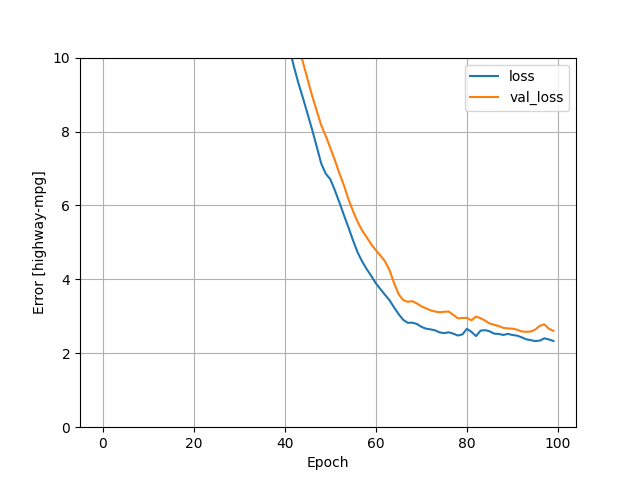
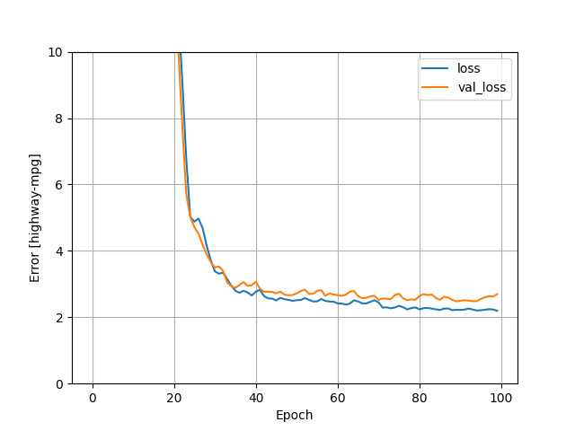
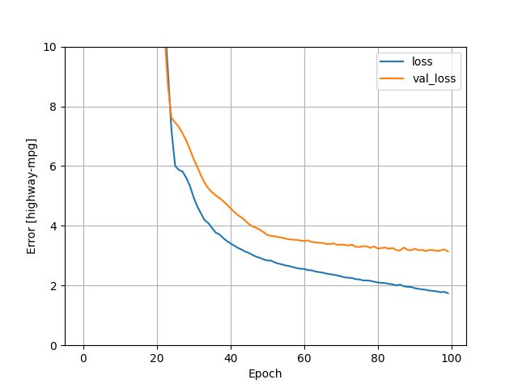

#Monday's Response: Auto Imports Regression
Here are the 2 models using only 4 classifiers: horsepower, number of cylinders, engine size, curb weight.

Multi-Class Linear Regression:

The error when the loss function when stabilized was around 2.3141

Multi-Class DNN Regression:
!
The error when the loss function when stabilized was around 2.0394

The DNN regression achieved a lower error, and therefore is the better model. The DNN regression seemed to stabilize in fewer epochs, which could mean it is also more computationally efficient, though that is somewhat irrelevant with how quick both of these models are.

##Best Model I could make
The best model I could make used these variables: highway mpg, peak rpm, num of cylinders, engine size, horsepower, curb weight, price
As table below suggests, the DNN model achieved a lower mean absolute error over 100 epochs, which indicates it performed better than the linear regression model.

                                    Mean absolute error [highway-mpg]
    linear_model                              2.235058
    dnn_model                                 1.943878

Here is the loss graph for the DNN model:
