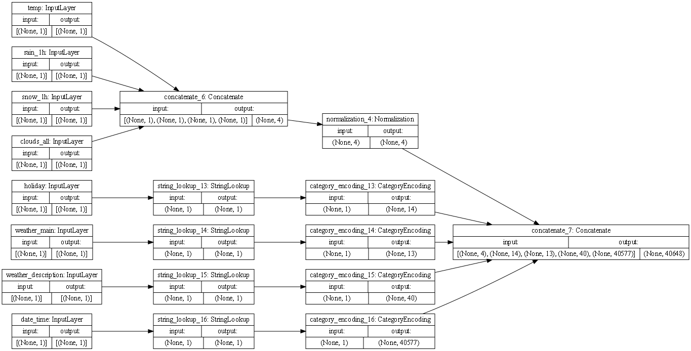
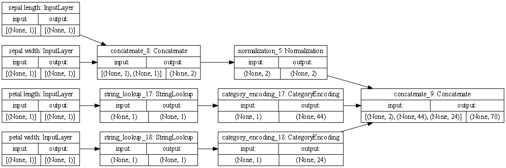

#Monday 3's Responses
1. plots
- Interstate
  
- Iris
  

2. Describe the plot of each model for the two dataset preprocessing steps. 
    - The Interstat data had multiple types, so strings had to be seperated from the continuous variables and then processed through category encoding. The continuous data was normalized and then the data was recombined to be put through the model.
3. What does each box in the illustration represent? 
    - In the first row of boxes, each box represents a feature. The rest of the rows of boxes represent the preprocessing layers applied to the features. 
4. Are there different paths towards the final concatenation step?
    - Yes, different paths for different data types because noncontinuous data and continuous data has to be preprocessed differently
5. What is occurring at each step and why is it necessary to execute before fitting your model. 
    - The first step in the interstate model is to separate out the features that are represented as objects(strings) and convert them to a numerical representation, that is what the sorting lookup boxes and the category encoding boxes are doing. The normalization box is going to normalize the continuous data that has been combined by the concatenate box.
    - The Iris data is all floats and integers, so it just needs to be concatenated and then normalized, as you can see in the simpler diagram.
    - It is important to do these steps to make the data readable to the model.
6. Train each model and produce the output (not necessary to validate or test). Describe the model output from both the metro traffic interstate dataset and the iris flowers dataset. 
    - I believe the loss function used in these models is a bad one for the interstate data because for I got an outlandish loss value of -226304384.0000 after 10 epochs.
    - The Iris data loss made a lot more sense, beginning at positive 0.6373 and ending at -0.9196.
7. What is the target for each dataset? How would you assess the accuracy of each model? Are you using a different metric for each one? Why is this so? What is each one measuring?
    - The interstate model target is the volume of traffic. The interstate model is not accurate at all
    - The iris model target is the correct identity of the type of flower. The model seems to be accurate with a low loss function, but I am not sure how to interpret loss values that start positive and end negative.