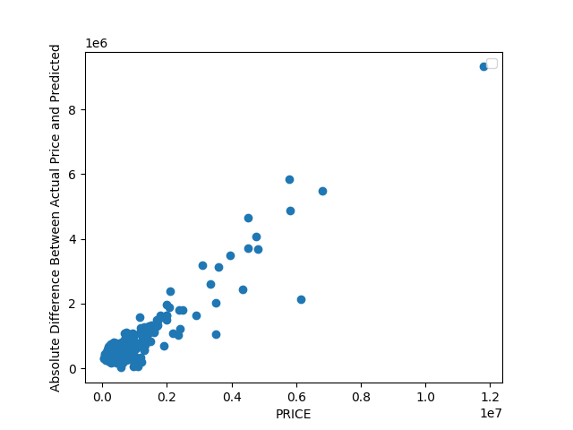

#Project 1
1. How did your model fare?
   - I used a dataset of 938 homes from Virginia Beach, and the model was able to predict housing prices with an MSE of 26.1582. As shown in the graph below the loss function became stable at around 26 at around 30th epoch. The model seemed to struggle when trying to predict prices for houses worth over $200,000.
    
2. In your estimation is there a particular variable that may improve model performance?
   - From what I understand about the Virginia Beach area, proximity to the beach and proximity to certain socioeconomic areas are probably huge factors behind housing prices. I suspect including location, perhaps using longitudes and latitudes, would increase the accuracy of the model.
3. Which of the predictions were the most accurate? In which percentile do these most accurate predictions reside? Did your model trend towards over or under predicting home values?
   - The home in the dataset mapped to index 41 was the most accurate predicted price. The model predicted $450,773.14 while the actual price is $450,000. By plotting the absolute difference between the predicted price and actual price on a graph with the actual price let me to visualize at what prices the model was the least wrong. As you can see in the graph below, houses priced at $200,000 and less were the most accurate. Q1 is at $249,900(used describe()), so the model was most accurate in the first quartile.
    
   - As seen below, the model seemed to roughly equally over and under predict the value of homes priced at and under $200,000. However, the model severely under predicts the values of homes priced over $200,000. The graph shows that a few homes are priced way more than the main cluster of homes, and are likely skewing the model's MSE score and loss function. Note, the ticks of the price vs. predicted price graph are a little messed up so for reference when the x-axis says 0.6 it means $600,000 and when the y-axis reads 6 it means $600,000. The far point on the right is a home priced at $1.2 million.
    
4. Which feature appears to be the most significant predictor?
   - I created three new models each using only one of the features in the dataset: # of bedrooms, # of bathrooms, and the amount of living area. The amount of living area model was actually able to produce a model with a smaller MSE than using all three. Because of that I strongly believe living area is the strongest predictor of value. This also makes sense as larger houses are typically considered more expensive than smaller homes.
   - The 3 MSE's from the new models.
     Bedrooms: 41.349876570545774
     Bathrooms: 34.17113718292804
     Living Area: 25.86756573722997a