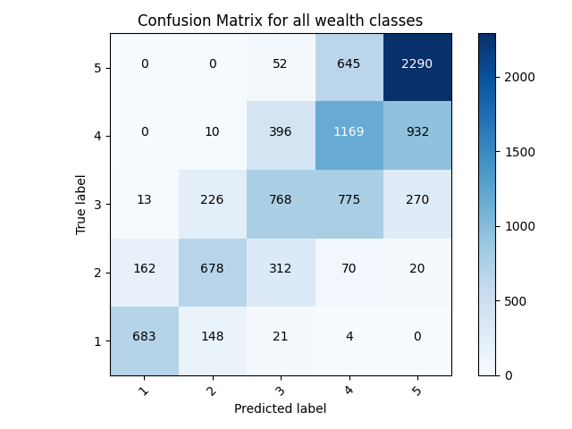

# Project 3
 
##Part 1
For predicting each wealth class vs the others I used a sequential model with 2 dense layers, one with 8 neurons and another with 16. I played around with the dropout rates and different numbers of neurons to see if I could control the overfitting that occurs when the amount of layers/neurons is increased. I ended up just sticking with a dropout rate of 0.1.

- The wealth class the model was the least accurate on was wealth class 2.
```
Wealth CLass 2: loss: loss: 0.4813 - accuracy: 0.7381 - val_loss: 0.4756 - val_accuracy: 0.7426
                      loss: 0.4829 - accuracy: 0.7375
```

- The wealth class the model was the most accurate on was wealth class 5.
```
Wealth Class 5: loss: 0.0997 - accuracy: 0.9594 - val_loss: 0.0979 - val_accuracy: 0.9619
                loss: 0.1051 - accuracy: 0.9607
```

##Part 2

- The confusion matrix from wealth class 2 shows that the model predicted almost none of the data was a 2, just 69 compared to the 9,575 it labeled as not 2. I noticed that a similar problem occurred when the model tried to predict if an instance was wealth class 3. It predicted a very small amount of the cases were 3's, it had an accuracy of around 79%. There must be some unique challenge to predict a wealth class 2 because the model seems to excel at predicting the extremes of the spectrum.


- The confusion matrix for wealth class 5 shows that the model was good at predicting 5s because there were so few of them, and you can see were the model predicted 9,000 of the instances were not 5s. The data is skewed to where there are so few 4s and 5s compared to 1s,2s,and 3s. A model like this one that is resistant to predicting an instance as a 1 will struggle on the more plentiful data groups while smaller ones will be more appear more accurate because 0 is disproportionally the correct answer for that data group. For that reason I am not so sure I trust these model's high accuracies at wealth classes 4 and 5.


##Part 3

```
All Wealth Classes: loss: 0.9405 - sparse_categorical_accuracy: 0.5710 - val_loss: 0.9201 - val_sparse_categorical_accuracy: 0.5742
                    loss: 0.9197 - sparse_categorical_accuracy: 0.5794
```
