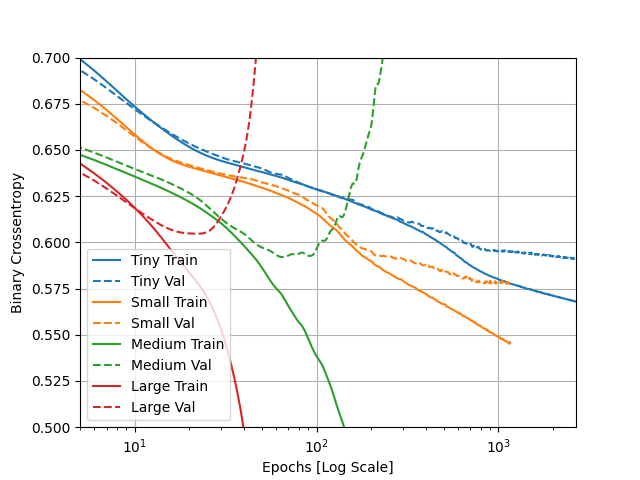
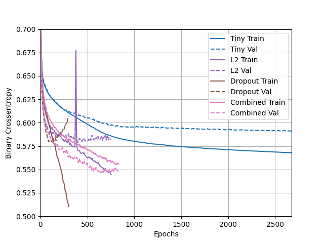

#Tuesday 2's Response: Overfit/Underfit
1. Describe the Dataset
    - The goal is to predict whether the input values indicate a signal from an exotic particle, or a signal from background noise. That is why the target is the binary classification in the first column where 1 = a signal and 0 = background noise.
    - 28 features are used
    - We are using 10,000 observations for training the model
    - 1,000 samples are being used for validation
    
2. How did the 4 models perform?
    - As seen below, the small model was able to bring validation loss the lowest, so it was the most successful. 
    - The large model's validation loss function started exponentially increasing and had the highest minimum, so that model was the least accurate on testing data.
    - When the two larger models began to get more accurate with the training data, they also saw a proportional increase in the loss function, which tells me that the larger models are learning the training data way too well and becoming bad at identifying more general patterns, reducing the accuracy of predictions performed on the testing data
    
      This plot illustrates the loss functions of the train and test data of each of the different sized models
 
3. Apply Regularization and Dropout
    
    - The L2 regularization and the dropout combined with the large model performed best and that makes sense to me because the restrictions on the complexity of the patterns the neurons are detection helps keep the overfitting in check, which forces the  neurons to detect the more general trends. This would explain why it performs better on the validation data than the other models. It is a bit underfit but still outperforms the other models.

4. What is an overfit model?
     - An overfit model has become way too accurate to the training data. When new data is input into the model, an overfit model will generally do terrible because its weights are not general enough to detect the trends shared by the two datasets. 
     - An overfit model needs to be addressed because there is a strong likelihood that your model isn't generalizable enough to be useful with analyzing new data.
     - We've used L2 regularization, dropout regularization, reducing the size of our neural network, and combining regularization techniques(specifically L2 regularization, dropout regularization)