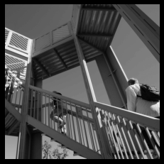
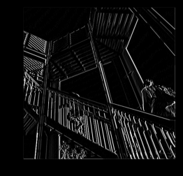
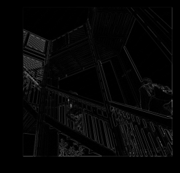

#Wednesday's Response: Convolutional Layers
1. In this exercise you manually applied a 3x3 array as a filter to an image of two people ascending an outdoor staircase. Modify the existing filter and if needed the associated weight in order to apply your new filters to the image 3 times. Plot each result, upload them to your response, and describe how each filter transformed the existing image as it convolved through the original array and reduced the object size. What are you functionally accomplishing as you apply the filter to your original array? Why is the application of a convolving filter to an image useful for computer vision? Stretch goal: instead of using the misc.ascent() image from scipy, can you apply three filters and weights to your own selected image? Describe your results.
    - Below is the original image.
    
    - This filter accentuates horizontal line
    
   filter = [[-1, -2, -1], [0, 0, 0], [1, 2, 1]]
    - This filter makes the image really dark
    
   filter = [[0, 1, 0], [1, -4, 1], [0, 1, 0]]
    - This filter accentuates vertical lines
    
   filter = [[-1, 0, 1], [-2, 0, 2], [-1, 0, 1]]
      
    - When the convolutional filter is applied to the array, depending on the filter, certain structures in the pixels of the images are accentuated based on the struture of the filter. For example, the first filter above has three 0's in the middle with numbers above and below, which means as the filter is passed over the image pixel values that are arranged horizontally will be represented more in the new image than other structures, and that's why that filter accentuates horizontal lines.
    - The convolutional filter is useful with computer vision because it is able to reduce the size of images while preserving important structures. This does two things, making the model less computationally expensive(reduce runtime) and also can exaggerate the features that the model is looking for, increasing the validation accuracy by emphasizing more generalizable structures.  