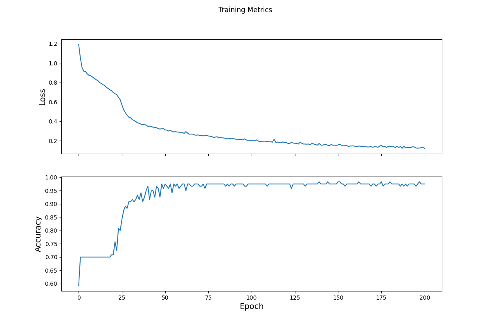

#Tuesday 3 Response

##The Data
- The Iris data set has 120 observations with 4 feature columns with various measurements of parts of the plants. Those measurements are sepal length, sepal width, petal length, and petal width. Each observation is labeled either setosa(0), versicolor(1), or virginica(2). The data was loaded in with tf.keras.util.get_file(). The URL to where the dataset is stored was in the parentheses. The tf.data.experiment.make_csv_dataset function was used with a batch size of 32 to create the dataset the model would run on.

##The Model
- The model architecture consists of 2 dense layers with 10 neurons using rectified linear activation functions. The input shape is 4 because there are 4 features. The third layer has 3 neurons, and it outputs 3 probabilities of how likely the observation is to be each of the 3 labels. The loss function used was sparse categorical crossentropy. The model was trained over 201 epochs.

##Optimization and Loss
- The model uses a standard gradient descent optimizer to figure out the best way to decrease loss. Think of it as a ball on a hill, looking for the fastest way to the bottom(the bottom being the lowest loss). However, the model has to be careful because the bottom of the hill might not be the true bottom, so it has methods of searching for the absolute minimum where the model is performing its best. Sparse Categorical Crossentropy is the chosen loss function because there are more than two labels, and the labels are integers(0,1, and 2). This lets us produce a range of 3 probability scores of how likely the model thinks an observation is each of the 3 labels.

This graph shows the decrease in loss per epoch


##Test the Model
- A new iris dataset that is larger than the first was used to test the model. That dataset is structured the same as the first dataset, so we could use the same preprocessing. The data was fed through the model and the output was an array of logits which represent the probabilities the model has assighned. The argmax function outputs the logit of the largest probability, which represents the label the model thinks is the most likely to be the true label. The model performed with a 93.3% accuracy on the new dataset that it had never seen before. The model had an accuracy on the training data of 97.5% for the final epoch, which is higher than the test accuracy which indicates the model is overfitting to the train data.

##My Testing
- I fed 3 of my own made up data points into the model:
```
    Example 0 [5, 3, 2, 1]
    Example 1 [4, 2, 4, 1]
    Example 2 [7, 4, 5, 1]
    
    Example 0 prediction: Iris setosa (80.7%)
    Example 1 prediction: Iris virginica (92.5%)
    Example 2 prediction: Iris versicolor (98.0%)
```
