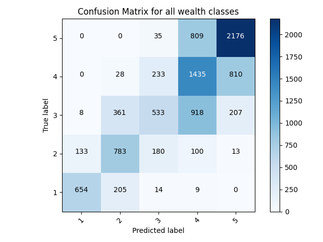
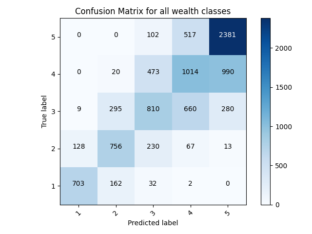
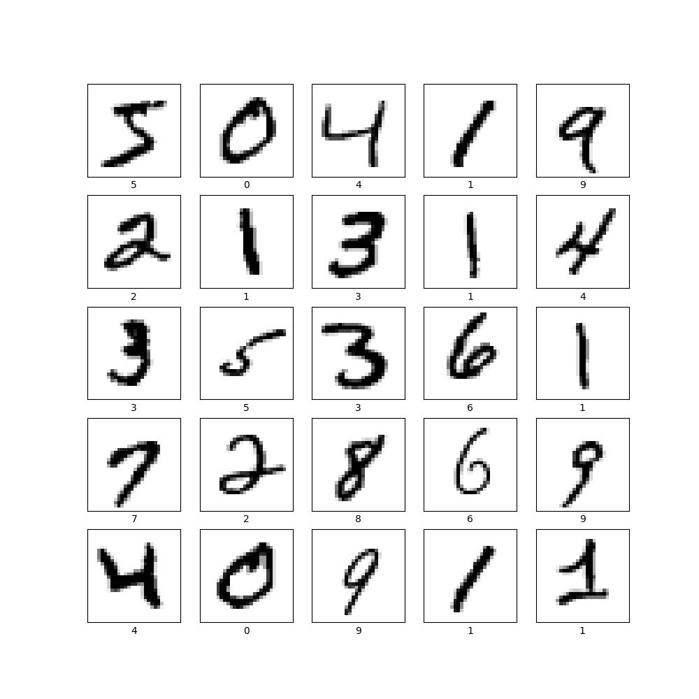

# Fashion MINST
## Preprocess the data
- Three images picked from the training data before any preprocessing.

## Make Predictoions
- This is the array of predictions for the test image with index 300: array([3.7368207e-04, 3.9547193e-04, 4.1014126e-05, 9.9806482e-01,
  2.8693648e-05, 1.8663444e-05, 2.0866326e-04, 3.3549023e-07,
  8.6848432e-04, 2.0397472e-07]) Each number in the list corresponds to a label of the data, of which there are ten. Each number itself is a percentage of how sure the model is that the image belongs with that label. The model assigned the highest number to the 4th label, which is a dress. 
- The softmax function puts e to the power of a value output by the ML model that represents a prediciton, of which there a multiple per input image. It then divides them by the sum of the new array of numbers, outputing an array of numbers that represent probabilities between 0 and 1. This was utilized to create an array that shows us how sure the model was that each of the labels belonged with the specific image. The largest number was the label the model was most sure belonged to an image. The Argmax function, which maps the largest value to 1 and maps the rest of the values to 0, was then utilized to extract which label the model was most sure belonged with a certain image. Softmax can generate a range of values that rank in a sensible way how likely the model thought each label belonged to the image, while argmax can be used to pull the largest value for a definitive answer.
- Yes, the output from argmax is equal to the test label.

## Verify Predictions

## Use the Trained Model

The is the array of predictions for test image 500: [4.1152876e-02 6.2762279e-05 5.7496119e-01 5.0511945e-04 4.7565032e-02
  2.1253111e-06 3.3462614e-01 1.7045195e-07 1.0369449e-03 8.7586945e-05]]
- The model correctly predicted that the image was a pullover.
- softmax was already included in the code used to generate prediction matrices/predictions, so it would warp the data in no helpful way if used twice on the data.

## Digits MINST

- The model fit had an accuracy of 0.9949 on the train data, 0.9778 on the test data

- After running both models repeatedly, the digits model semed to consistantly score at 95% and above on its accuracy on the test data, while the fashion model scored lower 90s and upper 80s accuracy scores on its test data. To me, that says that the digits model is more accurate.
